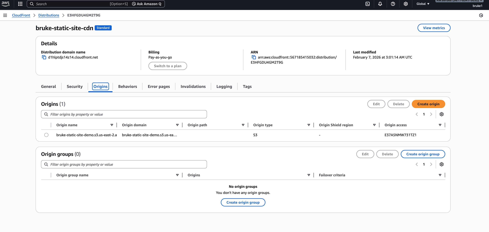

# AWS Cloud Labs
Hands-on AWS labs demonstrating cloud architecture, security, and scalability concepts. 

This repository contains hands-on AWS labs I’ve completed to build real-world cloud architecture skills.

## Labs

### 1. CloudFront + Private S3 Static Website
- Hosted a static website using Amazon S3
- Secured the bucket with Origin Access Control (OAC)
- Served content globally via CloudFront
- Resolved 403/404 errors caused by incorrect S3 endpoints and cache behavior

**AWS Services Used**
- Amazon S3
- Amazon CloudFront
- IAM
- AWS WAF (optional testing)

**Key Concepts**
- Private S3 access
- Origin Access Control (OAC)
- Cache invalidation
- HTTP vs HTTPS origin behavior

---

## Screenshots

### CloudFront – General Settings

### CloudFront – Origins (Private S3 with OAC)

### CloudFront – Behaviors

### CloudFront – Security

### S3 Bucket Policy (OAC)

### Site Live via CloudFront

## EC2 + Apache Web Server Lab
### Overview

Launched an EC2 instance (Free Tier)
Connected securely via SSH using key pairs
Installed and configured Apache (httpd)
Exposed HTTP (port 80) publicly
Restricted SSH (port 22) to my IP only
Verified the site from a browser

