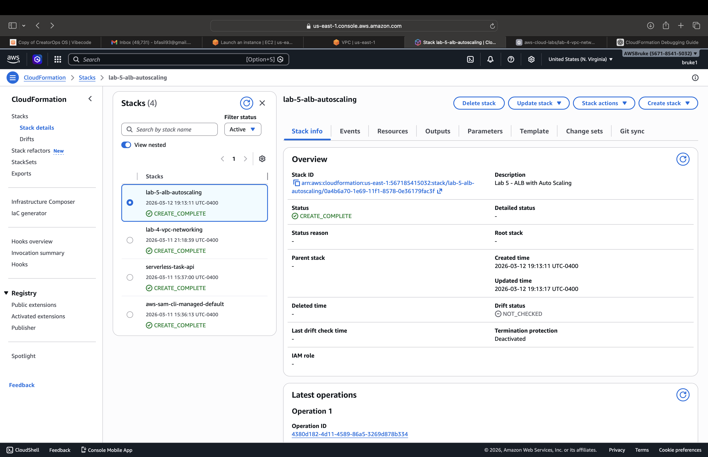
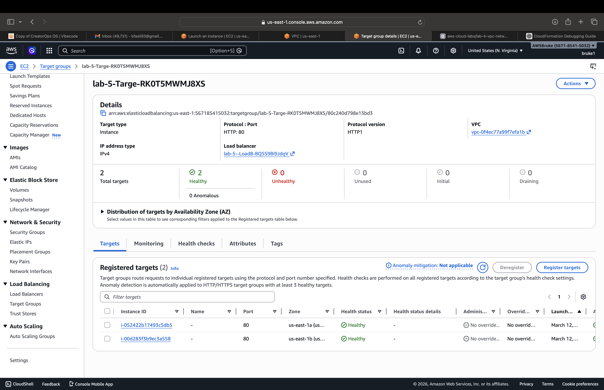
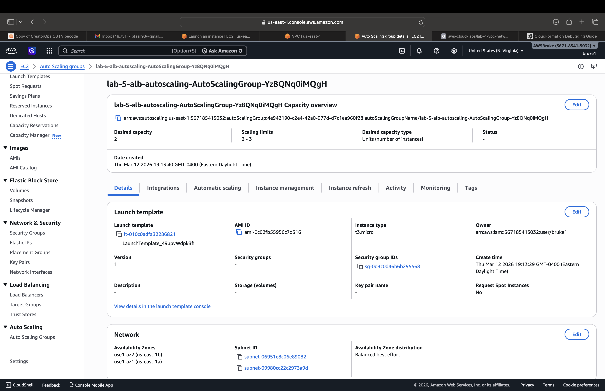
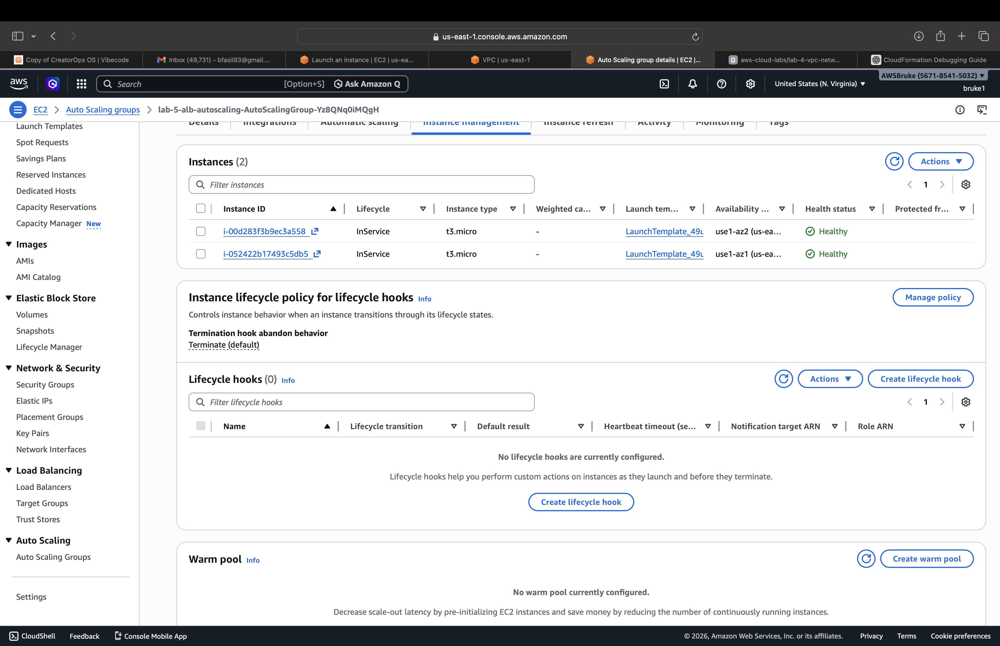

# AWS ALB + Auto Scaling Lab (Lab 5)

This project deploys a highly available web architecture using:

- Application Load Balancer
- Auto Scaling Group
- EC2 instances
- Target Groups
- Public subnets across multiple Availability Zones

## Architecture

Internet  
↓  
Application Load Balancer  
↓  
Target Group  
↓  
Auto Scaling Group  
↓  
EC2 Instances  

---

## Application Load Balancer



## Target Group



## Auto Scaling Group



## EC2 Instances




## Resources Created

| Resource | Purpose |
|--------|--------|
| Application Load Balancer | Distributes traffic |
| Target Group | Routes requests to EC2 |
| Auto Scaling Group | Maintains instance count |
| EC2 Instances | Serve web traffic |

## Deployment

```bash
aws cloudformation deploy \
--template-file template.yaml \
--stack-name lab-5-alb-autoscaling
