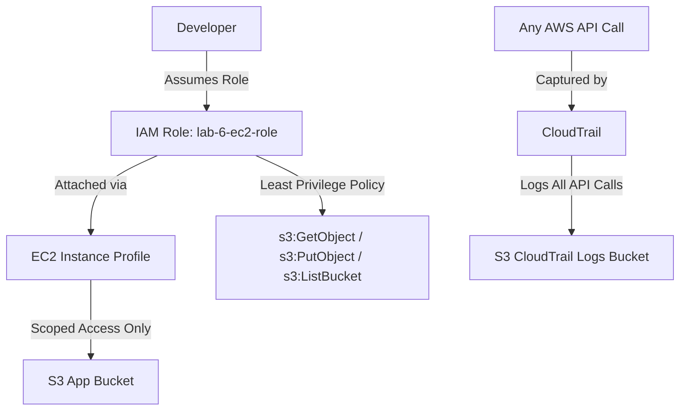

# Lab 6: IAM Security Hardening

## What This Lab Does
Deploys a security-hardened AWS environment using IAM least-privilege principles and audit logging.

## Architecture

## Resources Created
| Resource | Purpose |
|---|---|
| IAM Role | Least-privilege access for EC2 |
| EC2 Instance Profile | Attaches IAM role to EC2 |
| S3 App Bucket | Scoped data storage |
| S3 Logs Bucket | CloudTrail audit logs |
| CloudTrail Trail | Logs all AWS API calls |

## Key Security Concepts
- **Least Privilege** - EC2 role only has s3:GetObject, s3:PutObject, s3:ListBucket
- **Audit Logging** - CloudTrail records every API call made in the account
- **IaC Security** - All IAM resources defined in CloudFormation for auditability

## Deployment
```bash
aws cloudformation deploy \
  --template-file lab-6-iam-security.yaml \
  --stack-name lab-6-iam-security \
  --capabilities CAPABILITY_NAMED_IAM
```