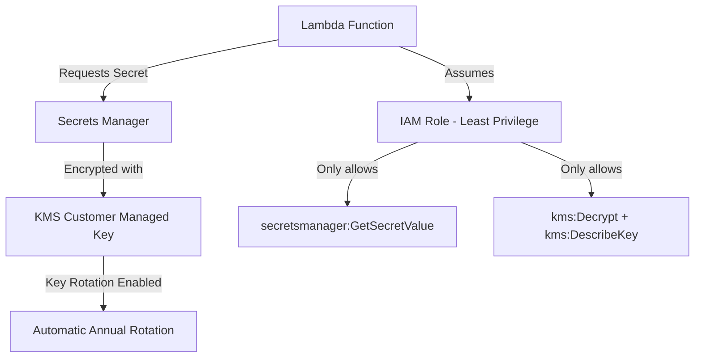

# Lab 7: KMS & Secrets Manager Encryption

## What This Lab Does
Deploys a secure secrets management system using AWS KMS Customer Managed Keys
and Secrets Manager to eliminate hardcoded credentials.

## Architecture


## Resources Created
| Resource | Purpose |
|---|---|
| KMS Customer Managed Key | Encrypts secret at rest |
| KMS Key Alias | Human-readable name for the key |
| Secrets Manager Secret | Stores DB credentials securely |
| IAM Role | Least-privilege access for Lambda |
| Lambda Function | Retrieves secret at runtime |

## Key Security Concepts
- **No Hardcoded Credentials** - Lambda retrieves secrets at runtime via Secrets Manager
- **Encryption at Rest** - Secret encrypted using Customer Managed KMS Key
- **Key Rotation** - KMS key automatically rotates annually
- **Least Privilege** - Lambda role only has access to this specific secret

## Deployment
```bash
aws cloudformation deploy \
  --template-file lab-7-kms-secrets.yaml \
  --stack-name lab-7-kms-secrets \
  --capabilities CAPABILITY_NAMED_IAM
```

## Testing
```bash
aws lambda invoke \
  --function-name lab-7-secret-retriever \
  --payload '{}' \
  response.json && cat response.json
```