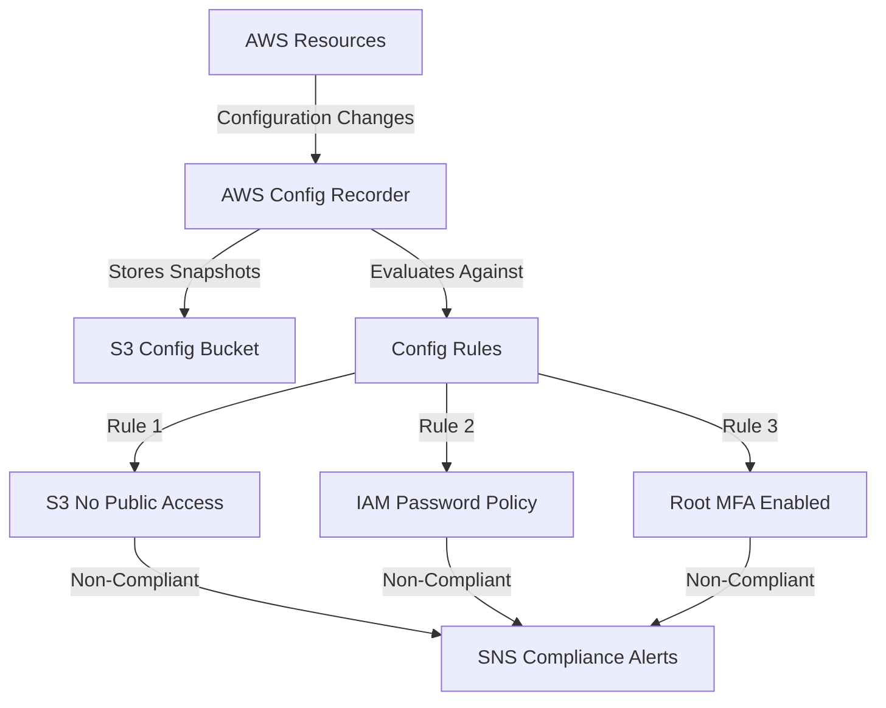
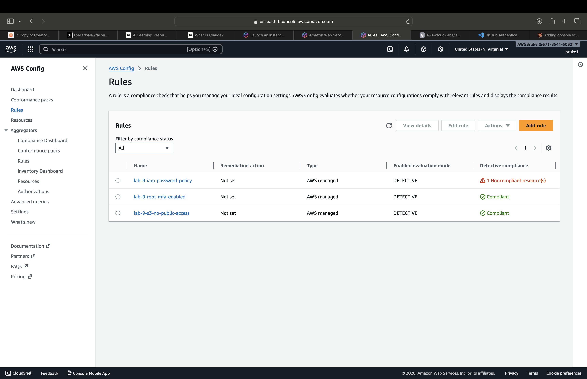

# Lab 9: AWS Config Compliance & Drift Detection

## What This Lab Does
Deploys AWS Config to continuously monitor and evaluate AWS resources for compliance against security best practices. Automatically detects configuration drift and sends alerts when resources become non-compliant.

## Architecture


## Resources Created
| Resource | Purpose |
|---|---|
| Config Recorder | Records all resource configuration changes |
| S3 Config Bucket | Stores configuration snapshots |
| IAM Config Role | Allows Config to read all resources |
| SNS Topic | Sends non-compliance alerts |
| S3 Public Access Rule | Flags publicly accessible S3 buckets |
| IAM Password Policy Rule | Enforces strong password requirements |
| Root MFA Rule | Ensures root account has MFA enabled |

## Key Security Concepts
- **Compliance as Code** - Security rules defined in CloudFormation, not manually
- **Continuous Monitoring** - Config evaluates resources automatically on every change
- **Drift Detection** - Alerts when resources deviate from approved configurations
- **CIS Benchmark Alignment** - Rules map directly to CIS AWS Foundations controls

## Compliance Rules
| Rule | What It Checks |
|---|---|
| S3_BUCKET_PUBLIC_READ_PROHIBITED | No S3 bucket allows public read access |
| IAM_PASSWORD_POLICY | Password min 14 chars, upper, lower, numbers, symbols |
| ROOT_ACCOUNT_MFA_ENABLED | Root account must have MFA enabled |

## Deployment
```bash
aws cloudformation deploy \
  --template-file lab-9-aws-config.yaml \
  --stack-name lab-9-aws-config \
  --capabilities CAPABILITY_NAMED_IAM
```

## Checking Compliance
```bash
aws configservice describe-compliance-by-config-rule \
  --query 'ComplianceByConfigRules[*].[ConfigRuleName,Compliance.ComplianceType]' \
  --output table
  
```
