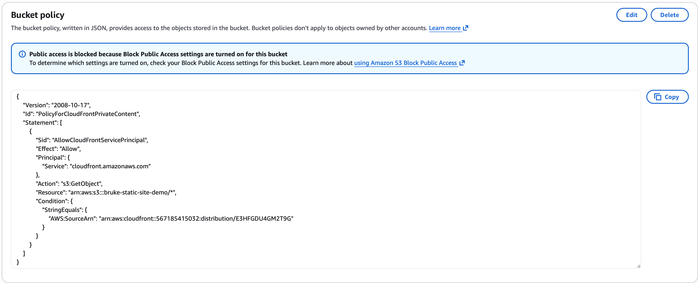
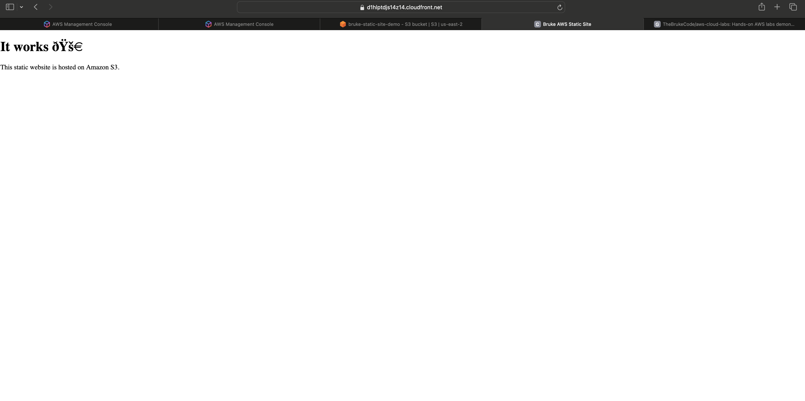

# Lab 1 – CloudFront + Private S3 Static Website

## Overview
This lab demonstrates hosting a static website on Amazon S3 while restricting
direct public access and serving content securely through CloudFront using
Origin Access Control (OAC).

## Architecture Highlights
- S3 bucket is private
- CloudFront acts as the public entry point
- OAC allows CloudFront to access S3 securely
- Bucket policies restrict direct access

## AWS Services Used
- Amazon S3
- Amazon CloudFront
- IAM (OAC)

## Screenshots
Lab 1 Screenshots.

### CloudFront Distribution Configuration

### S3 Bucket Permissions (OAC)

### Live Site via CloudFront

## Exam Relevance (SAA-C03)
- Secure content delivery
- Edge services
- Least privilege access
