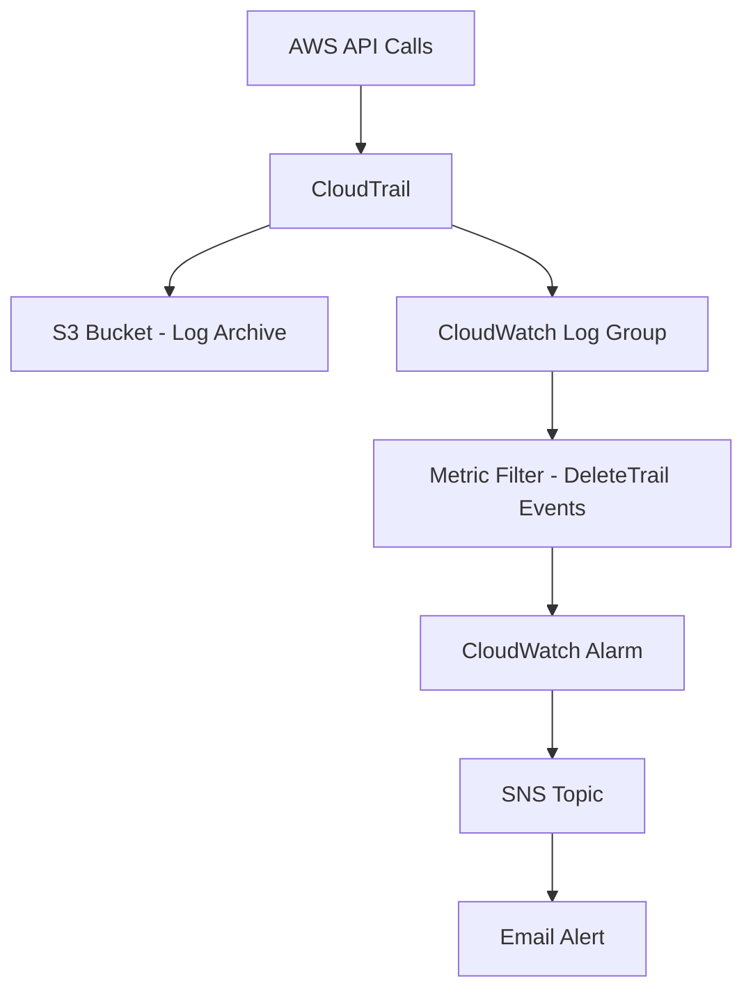

# Lab 10 - CloudTrail Security Monitoring

## Overview
Built a security monitoring pipeline using AWS CloudTrail, CloudWatch, and SNS to detect and alert on suspicious API activity in real time.

## Architecture


## Resources Created
- **CloudTrail** - Multi-region trail with global service events
- **S3 Bucket** - Encrypted log archive
- **CloudWatch Log Group** - Real-time log streaming
- **Metric Filter** - Detects `DeleteTrail` API calls
- **CloudWatch Alarm** - Triggers on suspicious activity
- **SNS Topic** - Security alert notifications
- **IAM Role** - Least-privilege CloudTrail logging

## Key Concepts
- Security monitoring and threat detection
- CloudWatch metric filters for API event detection
- SNS alerting pipeline
- Infrastructure as Code via CloudFormation

## Deployment
```bash
aws cloudformation deploy \
  --template-file template.yaml \
  --stack-name lab10-cloudtrail-monitoring \
  --capabilities CAPABILITY_NAMED_IAM
```
## Screenshots

### CloudFormation Stack - CREATE_COMPLETE


### CloudTrail - SecurityTrail Active


### CloudWatch Alarm


### SNS Topic


### S3 Bucket
