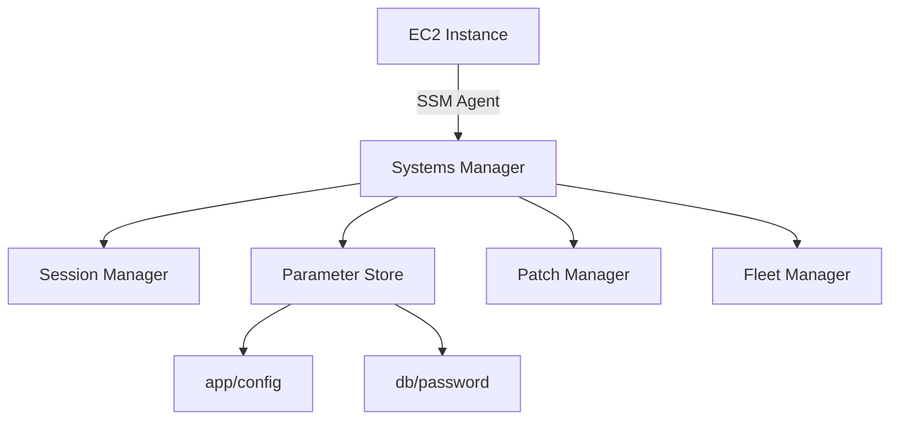
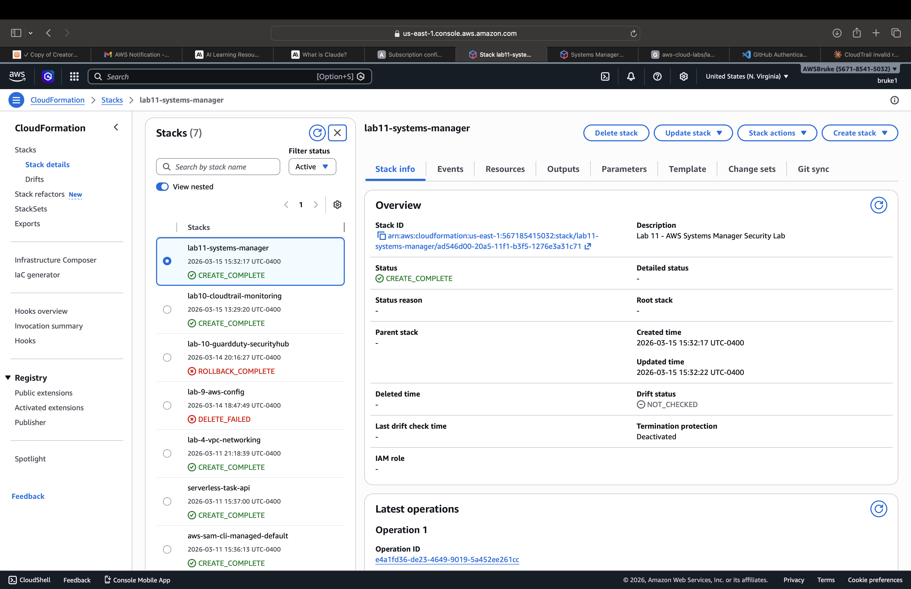
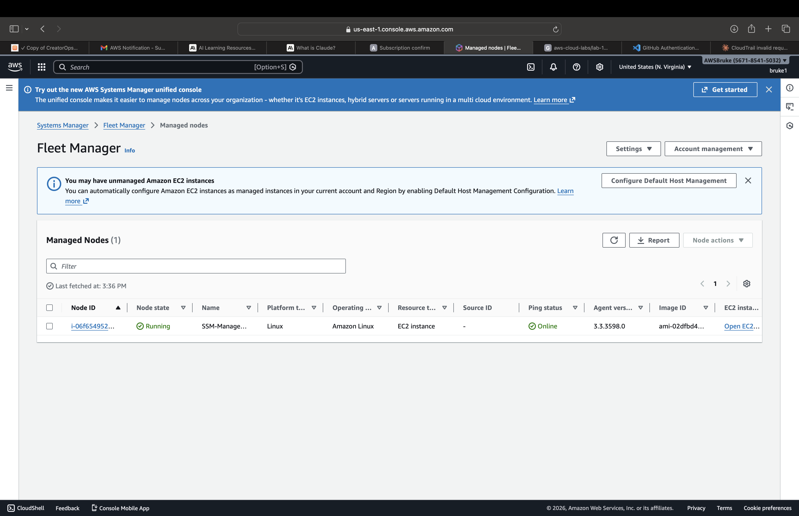
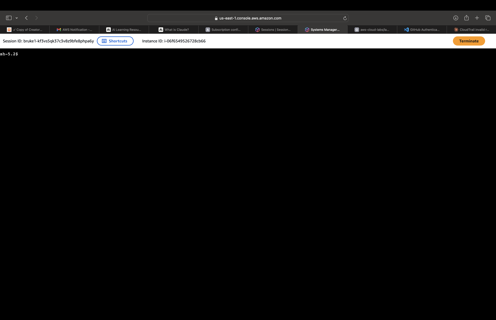

# Lab 11 - AWS Systems Manager (SSM)

## Overview
Built a secure EC2 management pipeline using AWS Systems Manager, eliminating the need for SSH keys or bastion hosts. Demonstrates modern cloud operations and security best practices.

## Architecture


## Resources Created
- **EC2 Instance** - SSM managed, no SSH key required
- **IAM Role** - AmazonSSMManagedInstanceCore policy
- **Session Manager** - Browser-based terminal access
- **Parameter Store** - Hierarchical secure config storage
- **Patch Baseline** - Security patch compliance policy
- **VPC + Subnet** - Isolated network environment

## Key Concepts
- Eliminates SSH bastion host pattern from Lab 4
- Least-privilege IAM for instance management
- Secrets and config management via Parameter Store
- Automated patch compliance and reporting

## Security Improvement Over Lab 4
| Lab 4 (Bastion Host) | Lab 11 (SSM) |
|---------------------|--------------|
| SSH key management | No keys needed |
| Open port 22 | No inbound ports |
| Bastion EC2 cost | No extra instance |
| Manual access logs | Automatic audit trail |

## Deployment
```bash
aws cloudformation deploy \
  --template-file template.yaml \
  --stack-name lab11-systems-manager \
  --capabilities CAPABILITY_NAMED_IAM
```

## Screenshots
### CloudFormation - CREATE_COMPLETE


### Fleet Manager - Instance Online


### Session Manager - Browser Terminal


### Parameter Store


### Patch Manager
