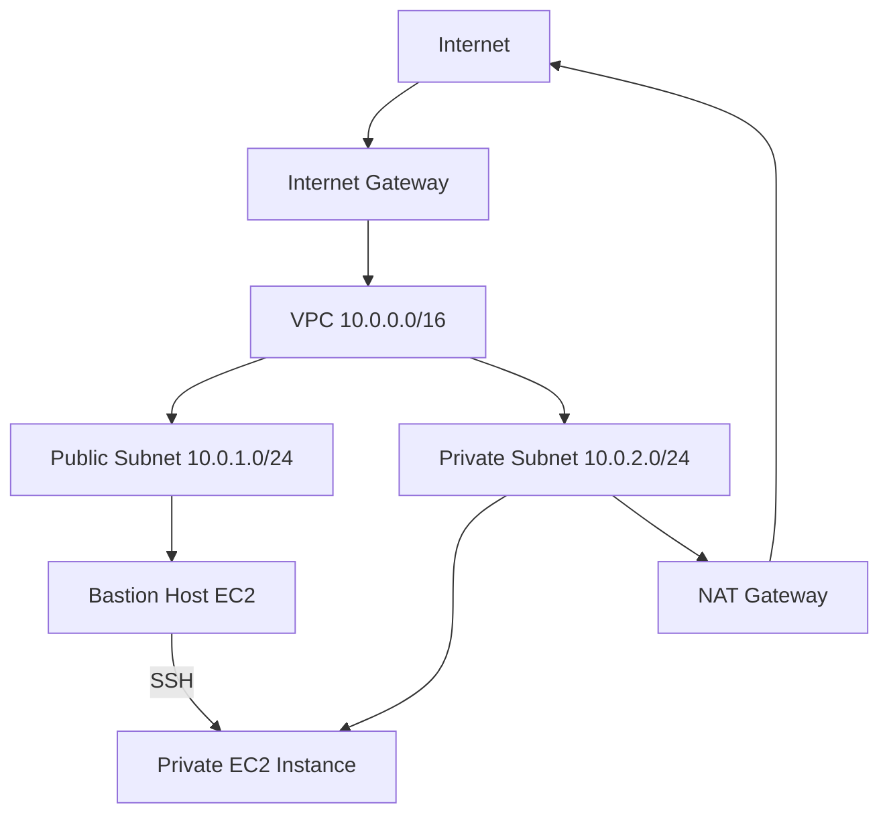

# AWS VPC Networking Lab (Lab 4)

This project provisions a complete AWS VPC infrastructure including public and private subnets, internet access, NAT gateway, and EC2 instances demonstrating the Bastion Host pattern.

## Skills Demonstrated

- AWS VPC design
- Public and private subnet architecture
- Bastion host SSH pattern
- NAT gateway for outbound private subnet traffic
- Route tables and security groups
- Infrastructure deployment with CloudFormation

### Architecture Overview

The diagram below illustrates the VPC network design used in this lab, including a public bastion host used to securely access a private EC2 instance within a private subnet.

---

## Architecture




## Resources Created

| Resource | Details | Purpose |
|---|---|---|
| VPC | LabVPC (10.0.0.0/16) | Main network container |
| Internet Gateway | igw attached to LabVPC | Enables public internet access |
| Public Subnet | 10.0.1.0/24 | Hosts public-facing resources |
| Private Subnet | 10.0.2.0/24 | Hosts backend/internal resources |
| NAT Gateway | lab-4-nat-gw | Outbound internet for private subnet |
| Elastic IP | Auto-assigned | Static IP for NAT Gateway |
| Public Route Table | 0.0.0.0/0 → IGW | Routes public traffic to internet |
| Private Route Table | 0.0.0.0/0 → NAT | Routes private traffic via NAT |
| S3 VPC Endpoint | vpce | Private S3 access without internet |
| Public EC2 | lab-4-public-ec2 (t3.micro) | Bastion Host / jump server |
| Private EC2 | lab-4-private-ec2 (t3.micro) | Private backend instance |
| Public Security Group | lab-4-public-sg | SSH from My IP only |
| Private Security Group | lab-4-private-sg | SSH from VPC CIDR only (10.0.0.0/16) |

---

## Key Concepts

**Internet Gateway** — Two-way door between the VPC and the internet. Required for public subnets to send and receive internet traffic.

**NAT Gateway** — One-way door for private subnets. Allows private instances to make outbound requests (e.g. software updates) without being directly reachable from the internet.

**Bastion Host** — A public EC2 instance used as a secure jump server to SSH into private instances that have no public IP address.

**Route Tables** — Define where network traffic is directed. A subnet is "public" only if its route table has a route to an Internet Gateway.

**Security Groups** — Virtual firewalls controlling inbound/outbound traffic at the instance level.

---

## Bastion Host SSH Pattern

```bash
# Step 1 — SSH into public instance (Bastion Host)
ssh -i ~/.ssh/lab-4-key.pem ec2-user@100.54.77.159

# Step 2 — From inside the public instance, SSH into private instance
ssh -i ~/.ssh/lab-4-key.pem ec2-user@10.0.2.211

# Step 3 — Exit back through
exit  # leaves private instance
exit  # leaves public instance
```

---

## Prerequisites

- AWS CLI installed and configured (`aws configure`)
- IAM permissions for VPC, EC2, and CloudFormation
- AWS account in `us-east-1` (N. Virginia)

---

## Deployment

```bash
aws cloudformation deploy \
  --template-file template.yaml \
  --stack-name lab-4-vpc-networking
```

---

## Cleanup

> ⚠️ **Cost warning:** NAT Gateways, Elastic IPs, and running EC2 instances incur charges. Always clean up after lab work.

**Terminate EC2 instances:**
EC2 Console → Instances → Select both → Instance State → Terminate

**Delete the CloudFormation stack:**
```bash
aws cloudformation delete-stack \
  --stack-name lab-4-vpc-networking
```

---

## Tools Used

- AWS VPC, EC2, CloudFormation
- AWS CLI
- YAML / Infrastructure as Code
- SSH / Bastion Host pattern
