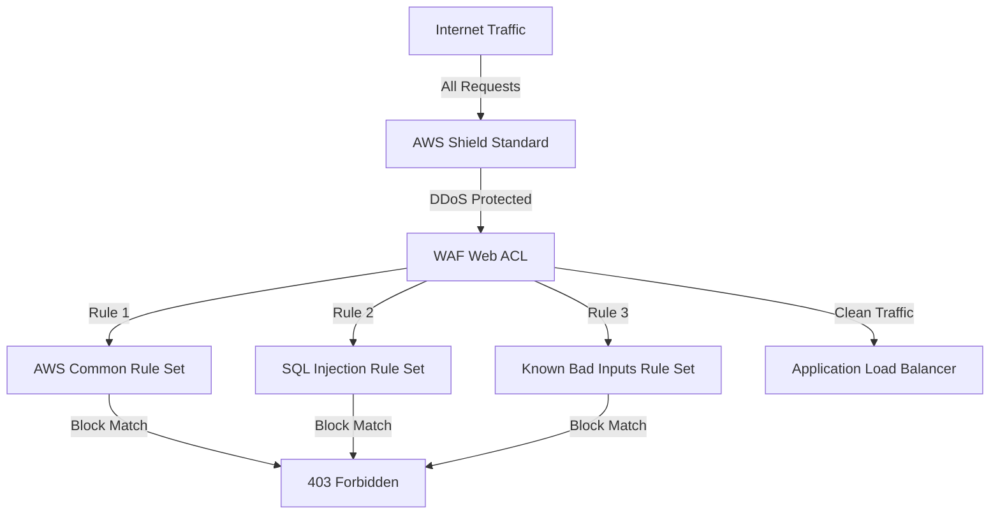

# Lab 8: AWS WAF & Shield Protection

## What This Lab Does
Deploys a web application firewall using AWS WAF v2 with managed rule groups to protect against common web attacks including SQL injection, XSS, and known bad inputs. Integrated with AWS Shield Standard for DDoS protection.

## Architecture


## Resources Created
| Resource | Purpose |
|---|---|
| VPC + Subnets | Network foundation |
| Application Load Balancer | WAF attachment point |
| WAF Web ACL | Traffic inspection and filtering |
| Common Rule Set | Blocks OWASP Top 10 attacks |
| SQLi Rule Set | Blocks SQL injection attempts |
| Known Bad Inputs | Blocks known malicious payloads |

## Key Security Concepts
- **WAF Web ACL** - Inspects every HTTP request before it reaches your app
- **Managed Rule Groups** - AWS-maintained rules updated automatically as new threats emerge
- **Shield Standard** - Always-on DDoS protection included with every AWS account
- **Defense in Depth** - Multiple rule layers mean attackers must bypass all of them

## Live Test Result
SQL injection attack `?id=1'+OR+'1'='1` returned `403 Forbidden` — blocked by WAF before reaching the ALB.

## Deployment
```bash
aws cloudformation deploy \
  --template-file lab-8-waf-shield.yaml \
  --stack-name lab-8-waf-shield
```

## Testing WAF
```bash
# Get ALB DNS
ALB_DNS=$(aws cloudformation describe-stacks \
  --stack-name lab-8-waf-shield \
  --query 'Stacks[0].Outputs[?OutputKey==`ALBDNSName`].OutputValue' \
  --output text)

# Test SQL injection block
curl -s -o /dev/null -w "%{http_code}" \
  "http://$ALB_DNS/?id=1'+OR+'1'='1"
# Expected: 403
```